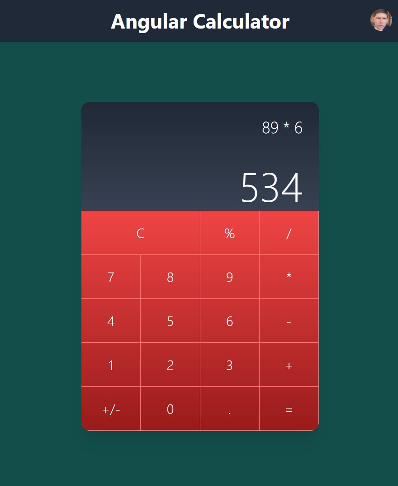

# Calculator Project
This is an Angular 'Calculator' project that is building in Angular.  It would allow users to calculate basic math problems.



## Table of Contents
* [Technologies](#technologies)
* [What Patrick did use](#what-patrick-did-use)
* [Install dependencies](#install-dependencies)
* [Start Server](#start-server)
* [Contact](#contact)

## Technologies 
- TypeScript
- NPM
- Angular
- Tailwind CSS

## What Patrick did use
- ng-container
- ng-template
- ngFor
- @apply in CSS file
- ngClass
- Array to store all keys for calculator
- @Output
- @Input
- EventEmitter
- Routing

## Install dependencies
Clone this repository and open your terminal and go to the root of the directory of this project.
Then execute the following at your command or terminal:
```
npm install
```

## Start server
Open your terminal and go to the root of the directory of this project.
Then run the following at your command or terminal:
```
ng serve
```

It will run the web application at http://localhost:4200.  Please go to the browser and type it in the address. It should show as the screenshot above.

## Contact
Created by [Patrick Wallin](https://www.linkedin.com/in/patrick-wallin) - feel free to contact me!
